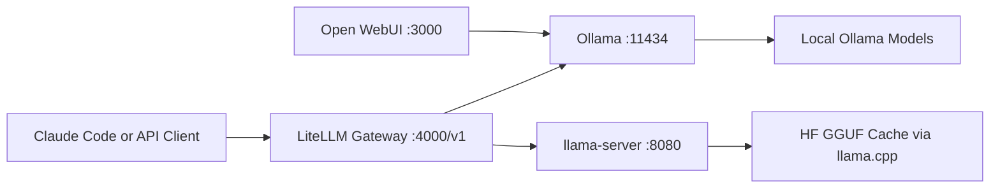

# Local AI Workload Solution Architecture

## Purpose

This document captures the end-to-end architecture for local-ai-workload on macOS Apple Silicon, with Docker Desktop as primary runtime and Homebrew llama.cpp binaries from PATH for the quality lane.

## Scope

- Local development and design assistant workflows
- OpenAI-compatible endpoint for editor tooling
- Dual-runtime serving: Ollama + llama.cpp
- Gateway-based model routing and optional cloud fallback
- RAM-aware operation for a 64 GB system with 24 GB reserved for non-AI workloads

## Platform Constraints

- Hardware: Apple M4 Max, 64 GB unified memory
- Reserved memory target: 24 GB for non-AI apps
- AI operating budget target: 32-36 GB active usage
- Runtime policy: one heavy quality model active at a time

## High-Level Architecture



## Components

1. Gateway
- Service: LiteLLM container
- File: config/router.yaml
- Responsibility: single OpenAI-compatible API surface and route abstraction
- Endpoint: http://localhost:4000/v1

2. Ollama lane
- Service: ollama via brew services
- Endpoint: http://localhost:11434
- Role: fast/general local models and design/writing profile defaults

3. llama.cpp quality lane
- Binary: llama-server from Homebrew PATH
- Endpoint: http://localhost:8080
- Model source: Hugging Face via --hf-repo + --hf-file
- Role: high-quality coding/review profile

4. Docker Model Runner lane
- Service: Docker Desktop model runner (vllm-metal/llama.cpp backend)
- Endpoint: http://localhost:12434/v1
- Role: optional auxiliary runtime used by Docker model commands

5. Open WebUI
- Container endpoint: http://localhost:3000
- Role: human-friendly UI for local model interaction

## Key Configuration Files

- .env: active runtime settings
- .env.example: baseline template
- config/router.yaml: gateway model aliases and backend routes
- config/profiles.yaml: workload profile mapping and fallback policy
- docker/docker-compose.yml: gateway container lifecycle

## Runtime Model Mapping

- local-coder-fast -> Ollama coding model
- local-coder-quality -> llama.cpp quality model (HF GGUF)
- local-general -> Ollama general model
- cloud-fallback -> optional remote model (disabled by default)

## Control Scripts

- scripts/bootstrap.sh: phase setup bootstrap (Docker + toolkit)
- scripts/pull-models.sh: pull required Ollama models
- scripts/start-all.sh: start Ollama validation, optional llama-server, gateway
- scripts/stop-all.sh: stop gateway and llama-server PID
- scripts/healthcheck.sh: service and endpoint checks
- scripts/benchmark.sh: benchmark prompts with latency and token usage

## Step-by-Step Guide (Shareable Runbook)

1. Prepare environment
```bash
cd /Users/sithukyaw/work/local-ai-workload
cp .env.example .env
```

2. Bootstrap phase 2 dependencies
```bash
./scripts/bootstrap.sh
```

3. Pull Ollama models for routing aliases
```bash
./scripts/pull-models.sh
```

4. Configure quality lane in .env
- Set LLAMA_HF_REPO
- Set LLAMA_HF_FILE
- Keep LLAMA_ALIAS=local-coder-quality

5. Start full stack
```bash
./scripts/start-all.sh
```

6. Validate service health
```bash
./scripts/healthcheck.sh
```

7. Validate gateway quality route
```bash
curl -s http://localhost:4000/v1/chat/completions \
  -H 'Content-Type: application/json' \
  -H "Authorization: Bearer ${LITELLM_MASTER_KEY}" \
  -d '{"model":"local-coder-quality","messages":[{"role":"user","content":"Reply with exactly: ready"}],"temperature":0,"max_tokens":12}' | jq -r '.choices[0].message.content // .error.message'
```

7b. Validate Claude protocol route
```bash
curl -s http://localhost:4000/v1/messages \
  -H 'Content-Type: application/json' \
  -H "x-api-key: ${LITELLM_MASTER_KEY}" \
  -H 'anthropic-version: 2023-06-01' \
  -d '{"model":"local-coder-quality","max_tokens":24,"messages":[{"role":"user","content":"Reply with exactly: ready"}]}'
```

8. Run benchmark suite
```bash
./scripts/benchmark.sh
```

## Operational Checks

1. Health checks
- Ollama tags endpoint should return 200
- llama.cpp health should return 200 when phase 3 is active
- gateway liveliness and models should return 200

2. Latency checks
- Compare coding review vs design critique elapsed times from benchmark output

3. Resource checks
- Watch Activity Monitor memory pressure during heavy calls
- Keep single heavy quality request in flight for stable responsiveness

## Troubleshooting

1. llama.cpp health is 000
- Confirm LLAMA_HF_REPO and LLAMA_HF_FILE are valid
- Check logs/llama-server.log for download or model load errors
- Wait for first model download/cache warmup completion

2. gateway models returns non-200
- Confirm local-llm-gateway container is running
- Validate Authorization header uses Bearer local-ai-workload

3. Ollama model not found
- Re-run scripts/pull-models.sh
- Confirm model names match router alias mapping

4. Slow first response
- Expected during first download and first-load warmup
- Subsequent calls improve after model and KV cache warmup

## Security and Data Notes

- Local prompts and responses remain on-device for local routes
- Cloud fallback is disabled by default via ENABLE_CLOUD_FALLBACK=false
- Do not commit .env or logs with sensitive keys

## Claude Code Provider Layer (Implemented)

Gateway preference is LiteLLM-first with conditional Anthropic adapter only if required.

- Compatibility status: local gateway supports /v1/messages and /v1/models with both bearer and x-api-key auth.
- Current implementation path: LiteLLM-only (no additional adapter required).

Credential mode is apiKeyHelper-first with break-glass fallback:

- scripts/claude-api-key-helper.sh reads Keychain service first.
- scripts/claude-keychain-init.sh seeds Keychain from current LITELLM_MASTER_KEY.
- scripts/claude-keychain-rotate.sh rotates gateway key, updates .env, updates Keychain, and recreates gateway.
- scripts/install-claude-local-settings.sh creates .claude/settings.local.json for both Claude surfaces.

Mode switching:

- scripts/claude-mode.sh offline
- scripts/claude-mode.sh hybrid

Compatibility verification:

- scripts/claude-compat-check.sh validates Claude-style /v1/messages behavior.
- scripts/verify-modes.sh validates both offline and hybrid operating modes.
- OFFLINE_HYBRID_VERIFICATION.md documents formal pass criteria.

## Future Enhancements

1. Add automated profile-specific acceptance tests
2. Add periodic benchmark history report (CSV/JSON)
3. Add optional request queueing and concurrency caps in gateway
4. Add RAG ingest pipeline under rag/ with scheduled indexing windows
